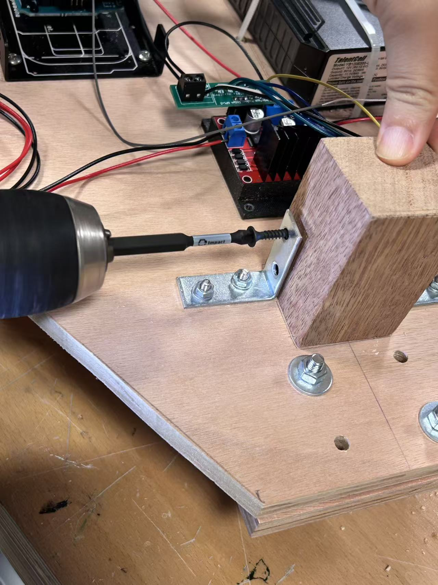

Robot Journal

Our group’s robot is the child in the story we are building for the Performing Robot project. 

We started by sketching the full design of the robot on paper to visualize its proportions and basic structure. The sketch helped us plan how to divide the body into separate parts—head, torso, and arms—and how to fit the motor and wiring inside.

After that, we began building the body using cardboard pieces. The main torso was formed from four boards, glued together to create a stable base. Each side of the body is made from an isosceles trapezoid, with the bottom edge measuring 30 mm and the top 40 mm. By gluing together four of these trapezoidal boards, we formed a tapered shape that looks a bit like a trash can, creating a cute, top-heavy silhouette. To make the panels stronger, we also cut rectangular reinforcement boards with the grain running perpendicular to the original cardboard and glued them inside to prevent bending and twisting.

For the head, forming a true sphere with cardboard was impractical, so we used a ring-based method. We cut three circular rings: the bottom ring provides the base; the middle ring is hollowed to leave a channel for the LED face screen wiring; and the top structure comes from two rings that we trimmed into a ¼-circle and a ½-circle. We stood those curved pieces upright and glued them together to create a sturdy hemisphere with an internal pass-through for cables.

After dry-fitting, we glued the ring segments and transitions, locking the hemisphere’s shape. This approach keeps the head light, cable-friendly, and visually round enough for an expressive “big-head” look.

We first glued only three of the four body panels together, leaving the back open for easier access during assembly. After the main shape was fixed, we cut several right-angle triangular pieces and attached them along the inner corners of the panels to reinforce the structure and keep the cardboard body stable.

With the head and body attached, the robot started to take shape. The proportions—big head, small body—created a slightly awkward but adorable silhouette.

After testing the fit, we completed the full body structure and checked that everything was well balanced.

Next, we began designing the motor holder. we first made a rough sketch to figure out the size and shape needed to support the servo motor securely. Instead of gluing the motor directly onto the cardboard body, we decided it would be stronger and more stable to mount it with nails and a wooden board. We cut a small piece of wood of suitable thickness and carved out a slot on the side that matched the motor’s dimensions, allowing it to fit perfectly and lock firmly in place.

Then we started cutting the wooden holder using the band saw machine. The outer edges were easy to cut, and we shaped the piece into a U-like form. However, the two inner 90-degree corners were difficult to reach cleanly. To solve this, we tried a different approach: we made many thin parallel cuts in the section that needed to be removed, as shown in the picture, slicing it into narrow strips. Then we used other tools to chip away or sand off those small strips to hollow out the middle. This method worked, but the inner surface came out quite rough, and the process sometimes caused the wood layers to separate.

Later, we asked Dustin for advice, and he showed us how to cut the inner 90-degree corners more effectively. He suggested starting from one side and cutting along a curved path, forming a quarter-circle that reaches one corner. Then, we made a vertical cut inward from that point, which naturally created a clean 90-degree angle. We repeated the same method on the other side, and finally used the machine to smooth out the uneven middle section—and the piece came out perfectly.

For the woodworking part, we also cut small wooden blocks to serve as the base supports. Since the base holds components like the battery, Arduino, and other electronics, we needed another wooden board above it to connect with the body section. However, we noticed that the front and back wheels were different in size, which made the base tilt forward instead of staying level. To fix this, we measured the height difference between the front and back of the base, then cut and sanded the small wooden blocks at matching angles. This way, when we placed the upper wooden board on top, it sat perfectly horizontal.

After completing all the preparation, we cut matching holes on both the left and right side panels of the body, each sized precisely to fit the motor holder. This allowed the holder to slot perfectly into the side boards, making the entire structure much more stable and secure.

 

We then drilled two holes in the wooden board according to the screw positions designed on the motor itself, and used nails to fasten it firmly in place. This ensured that the motor stayed securely attached and the whole structure remained stable during movement.

 

The lower wooden block was connected to the base using an L-bracket. We drilled holes in the base and secured the L-bracket with machine screws and nuts. However, because the wooden block was quite thick and the bolts weren’t long enough, we switched to wood screws instead. We first drilled small pilot holes slightly narrower than the screw diameter, then used the drill to drive the wood screws directly into the block. This way, the side of the L-bracket was firmly attached to the wooden block. The upper wooden board was also fixed to the block using the same type of wood screws, creating a solid and stable layered structure.

 

We then finish the base of the robot, attaching the horizontal support board where the wheels and lower parts would connect. With all the angled supports and adjustments in place, this created a perfectly level surface that could be securely connected to the body.

The next step was constructing the arms. For the cardboard arm, we cut small square and rectangular pieces of cardboard and used hot glue to assemble them into a rectangular box shape. The wrist section was made from a thin strip of cardboard rolled into a cylinder, which connected the box-shaped arm to the hand, a small cube at the end.

We also cut four rounded cardboard fingers of different lengths and attached them to the bottom of the cube hand, making it look more like a human-shaped hand and creating a strong contrast with the metal wire arm on the other side.

Next, we connected the arm to the motor’s horn. We cut a small rectangular cardboard plate and carved a horn-shaped slot in it so the horn could slide snugly into the thickness of the plate. Then we used hot glue to bond the plate to the horn and glued the arm to the plate. This gave us a larger bonding area and a much stronger, more reliable connection between the arm and the motor.

For the metal arm on the other side, we found wire mesh in the scene shop. 

 

It was very stiff, so we used bolt cutters to cut a 90-degree V-notch in the middle of the cylindrical mesh. This notch let us fold the mesh to a clean 90-degree bend. We then overlapped the two sides along the fold and secured the seam with zip ties, which locked the mesh into a stable tubular shape while keeping it lightweight and slightly flexible.

 

To fit the storyline, we designed the robot so that its metal arm holds a small hammer. At the end of the wire-mesh arm, we created a U-shaped hand using cardboard pieces cut to shape and attached them to the wire frame with hot glue. This design made the robot’s gesture clearer and connected it better to the narrative of the performance.

Next, we connected the wire-mesh arm to the motor horn. We threaded four zip ties through different openings of the mesh and cinched them around the horn to hold it in place. Then we applied a thick layer of hot glue over the contact area between the mesh and the horn, increasing the bonding surface and making the connection much more secure. Then, the whole arm was finished. 

 

After finishing both arms, we started preparing to install the Arduino Mega. Since we didn’t yet have the circuit board and a proper holder for the Mega, we temporarily connected the motor wires directly to the board just to test whether the arms could move properly with the motors. During testing, we discovered that the motor on the wire-mesh arm wasn’t functioning correctly, so we had to fully disassemble the setup, remove the motor, and replace it with a new one before reattaching everything. This process took quite a lot of time, and we learned that it’s better to complete all motor testing before assembling to avoid the need for rework later.

Then, we assembled the neck. To let the head rotate, we used a turntable swivel bearing (a “lazy Susan” bearing). We planned for the top plate of the bearing to be driven by the motor, so we first cut a motor-sized rectangular opening in the top cover board of the body and pressed the motor in for a snug, press fit. We then used hot glue along the motor’s mounting ears to bond them to the cardboard, preventing any wobble. From the side view, the motor shaft sat slightly higher than the top plate of the bearing, so we shimmed under the bearing with an extra layer of cardboard. This brought the motor horn and the bearing’s top plate to the same height, making the rotation interface aligned and stable.

 

We mounted the bearing by fastening both sides with hardware: the lower plate of the lazy-Susan bearing to the top deck of the body, and the upper plate to the head’s cardboard plate. For both connections, we drilled holes and used machine screws with nuts (and washers where needed) to secure everything tightly. On the top cardboard plate, we also cut a horn-shaped opening so the motor horn could seat directly into the plate; this way the horn keys into the cardboard and drives the bearing’s upper plate smoothly as it rotates.

We then cut another circular cardboard plate the same size as the underside of the head and used generous hot glue to bond it to the upper bearing plate, finishing the neck connection. We did not permanently glue the head onto this plate yet, because we may still need to cut openings in the circle or mount the LED face screen and other components (possibly another small motor). Keeping it unglued preserves access for wiring and adjustments.

 

By this point, the outer body structure was mostly finished, but it looked a bit too much like a real trash can. To make the robot cuter and softer, we decided to trim off the four top corners of the body—cutting out an equilateral triangle of 15 cm at each corner. This chamfered transition removes the harsh edges and gives the torso a rounder, friendlier silhouette.

Next, we prepared to wire the motors to the Arduino Mega. Since the center of the body is hollow, we added a cardboard crossbeam inside as a shelf for the Mega. The beam spans left–right, attaching to the two side panels, while we kept the front and back open to route cables cleanly. This crossbeam not only provides a stable mounting platform for the board but also stiffens the torso, making the whole body more rigid.

* Compared to the list above, what did you accomplish for last Thursday (October 23)?
  We have already completed everything we wrote, including connecting the body and base, the head and body, making two arms and controlling both arms using two motors. Since we don't have the circuit board on top of the arduino mega, we connect the servos to the arduino using jumper cables to test every motor work can work well. 
* What will you accomplish for this Thursday October 30?
  We plan to connect three servos to the Arduino Mega and make sure they can move properly. We also aim to complete the rotating antenna on the head, finish building the hammer for the hand, and design the structure for the eyes and other parts of the head.
* What features remain to be implemented?
  We still need to decorate the entire robot, build the outer shell for the head and other components, and reinforce the joints and connections between the arms and shoulders to ensure stable movement.

For the final moment of our play, the child robot needs to “end the case” by striking a judge’s gavel. To prepare for this, I started prototyping a lightweight gavel using simple cardboard materials. I first experimented with a plastic tube we found earlier, but it was still surprisingly heavy for the robot’s servo to lift comfortably. Eventually, I discovered that the inner cardboard tube from a decorative paper roll was much lighter. I cut a 30 cm segment to serve as the handle. 

For the gavel head, I rolled and layered pieces of cardboard into a cylindrical form. This combination keeps the prop structurally solid while remaining light enough for the robot to swing during performance.

We wanted to place a small antenna on top of the robot’s head, so the antenna motor needed to be securely mounted onto the top cardboard panel. The motor requires its plastic holder to be nailed in place, so we first attached the motor to the holder using small nails. Then we fixed the holder onto the cardboard head panel with another set of nails. However, the cardboard turned out to be thinner and softer than expected, so the nails alone didn’t provide enough stability. To reinforce it, we added several layers of tape around the holder to keep the motor firmly attached. This ensures the antenna can rotate smoothly without the whole mount wobbling.

To design the antenna, we first sketched a rough outline directly on a photo of the robot. We imagined how a bamboo stick would sit on the motor shaft and rotate as the motor turns. Using the photo as reference, we estimated the overall size and silhouette of the antenna so it would look balanced on the robot’s head. After finalizing the rough shape, we cut the antenna pieces out of cardboard. Once the pieces were shaped properly, we assembled them and used hot glue to secure everything in place. This created a lightweight, stable antenna structure that the motor could rotate smoothly.

After assembling the antenna structure, we moved on to wiring the NeoPixel LED panels and the motor to the Arduino Mega. Once everything was connected, we uploaded our test code—but the LED panel didn’t light up at all. Our first suspicion was that something might have gone wrong during soldering. We wondered if we had accidentally damaged the LED board, caused a short inside the panel, or broken one of the input/output pads.

Our professor suggested using a multimeter to check whether the panel itself was still functional. After testing continuity and measuring the connections, the board seemed perfectly fine. 

So we went back to the code. Eventually, we discovered the real issue: we had written the matrix dimensions in the wrong order. Because we were chaining two NeoPixel panels together, the matrix could be interpreted in two ways: 16 × 8 and 8 × 16. We had been assuming 8 × 16 the entire time, which caused the pixel mapping to be completely incorrect—making the board look like it wasn’t lighting up at all. After switching it to the correct 16 × 8, the LEDs finally displayed exactly what we coded. It turned out to be a coordinate-mapping bug, not a hardware problem.

We ran into a series of unexpected problems while testing the LED strip. At first, the strip wouldn’t light at all, and we couldn’t figure out why. Our professor suggested trying it with an Arduino Uno and one of the sample codes from the NeoPixel library. Surprisingly, the LED strip lit up normally on the Uno, which meant the strip itself wasn’t the issue.

However, when we connected the same strip to the Mega, only the very first LED lit up, and one more LED further down glowed extremely dim. When we touched the strip, it felt very hot, and even the wires near the connection point were heating up. This made us suspect that the strip might have been damaged during soldering—possibly a short circuit between the copper pads and the wires.

We replaced it with a brand-new LED strip. As soon as we powered it through the Mega, the LEDs became extremely bright, much brighter than expected. That immediately made us nervous, so we unplugged it right away to avoid burning it again.

After carefully tracing the connections, we finally discovered the real problem: the Mega was being powered from the wrong port of the power bank. The USB output provides 5V, which is what both the LED strip and the motor require. But earlier, we had accidentally plugged the Mega into the 12V output of the power bank. Feeding 12V into a system meant for 5V caused the LED strip to over-brighten and overheat, especially since the faulty soldering introduced additional shorting points. Fixing the power connection and replacing the strip resolved the issue.

After confirming the strip worked safely, we placed it inside the wire-mesh arm structure. The mesh itself is not visually strong enough on stage, so adding the LED strip inside makes the arm more visible and expressive under stage lighting.

After finishing all the individual components, we finally completed the full wiring layout on the Arduino Mega. In total, the robot uses six active ports, each responsible for a different moving or lighting feature. The left and right arms each have one motor, the neck has another motor for head rotation, and the antenna is driven by its own motor mounted on top of the head. For visuals, we connected two NeoPixel devices: one LED matrix for the eyes and one LED strip embedded inside the wire-mesh arm. With all six ports configured and powered correctly, the Mega now serves as the central hub coordinating every motion and lighting effect in the robot.

We also created a full power-system diagram to keep track of how every component is supplied. Both the Arduino Uno and the Arduino Mega are powered using the Anker power bank’s 5V USB output, ensuring stable and safe voltage for all the logic-level electronics. The two large motors at the base of the robot require a much higher voltage, so they are powered separately using the 12V output from the larger power bank.

All the motors and LED strips connected to the Mega run exclusively on 5V, supplied through the same power bank’s USB port. Drawing this diagram helped us clearly separate the 12V and 5V circuits, preventing accidental mis-wiring and avoiding the overheating issues we previously encountered.

